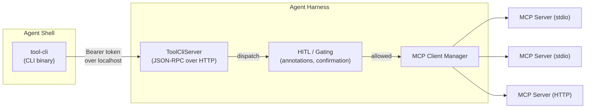

[](https://www.npmjs.com/package/@sammorrowdrums/tool-cli)

# tool-cli

> **Experimental.** Part of the [mcpi-ext](https://github.com/SamMorrowDrums/mcpi-ext) experiment.

```sh
npm install -g @sammorrowdrums/tool-cli
```

---


> _The Football is not a weapon. The Football is the authority to use weapons. Whoever holds it can reach any server, call any tool, chain any result — but they must do so deliberately, one command at a time._

---

## Why tool-cli exists

MCP gives agents tools. But the way those tools are exposed — all at once, all their schemas dumped into context — creates a problem. The agent sees everything, pays for everything, and still has to guess which tool to call.

**tool-cli is progressive discovery for MCP, with all the composability of bash.**

The agent already has a shell — tool-cli turns that shell into a gateway to every connected MCP server. Discovery happens in steps: servers → tools → schemas → calls. Each step pays only the tokens it needs. And because it's just a CLI binary, it composes with pipes, `jq`, loops, `xargs` — the entire Unix toolkit.

This is the nuclear football. It bestows executive control to the holder — every tool on every server is one command away. But like the real nuclear football, there's a dual lock. The agent holds the briefcase, but the harness holds the launch authority. The harness can gate calls, log them, or add human-in-the-loop confirmation at a single choke point. No individual actor goes rogue.

That's the design: **bestow executive control to the agent, but keep the safety in the infrastructure**.

---

## Usage

Discovery is progressive — each step reveals the next:

```sh
tool-cli                                     # List connected MCP servers
tool-cli github                              # List tools on a server
tool-cli github search_code                  # Show schema for a tool
tool-cli github search_code '{"query":"auth"}' # Call a tool
```

### Shell composability

This is a CLI. It composes like one.

```sh
tool-cli github search_code '{"query":"auth"}' | jq '.items[].path'

tool-cli myserver list_items '{}' | jq -r '.[0].id' | \
  xargs -I{} tool-cli myserver get_item '{"id":"{}"}'

for city in London Tokyo Paris; do
  echo "=== $city ==="
  tool-cli weather check_weather '{"city":"'"$city"'"}'
done

tool-cli github list_issues '{"repo":"owner/repo"}' --out /tmp/issues.json
```

Errors go to stderr with exit code 1 — safe for `&&` chaining and `set -e` scripts.

---

## Security — The Dual Lock

> _They pass the Football to the terminal. It is heavy with potential. Every tool on every server is one command away — but to trigger the tool, the harness must allow it._

The server uses token-based authentication and dynamic port allocation:

1. `start()` binds to a random available port and generates a 32-byte session token
2. Returns `{ port, token }` — the caller sets these as `TOOL_CLI_PORT` and `TOOL_CLI_TOKEN` env vars for agent subprocesses
3. Every request must include `Authorization: Bearer <token>` — rejected with 401 otherwise

This means:

- **Concurrent sessions** work — each gets its own port + token
- **Random processes can't call tools** — they don't have the token
- **Cross-session isolation** — one agent can't reach another's tools
- **No individual actor goes rogue** — the agent has reach, the harness has authority. Both must agree for the launch to proceed

See [#1](https://github.com/SamMorrowDrums/tool-cli/issues/1) for resource discovery support.

---

## Architecture — How the Harness Connection Works

The CLI doesn't connect to MCP servers directly. It speaks JSON-RPC to a lightweight HTTP server that runs _inside_ the agent harness. This is not a separate tool with its own auth — it's the harness itself, exposing its MCP connections over localhost for shell access.



Every call — whether from the CLI, from a programmatic client, or from sandboxed code — routes back through the harness. This gives you:

- **Agent activity logging preserved** — because calls flow through the harness, not around it, the existing agent audit trail captures every tool invocation. Nothing bypasses the log
- **Human-in-the-loop at one point** — the harness can check tool annotations (`readOnlyHint`, `destructiveHint`) and gate destructive calls through user confirmation
- **No special setup** — the harness already manages MCP connections. tool-cli just gives the agent shell access to them

```typescript
const { port, token } = await server.start();
// Set env vars so agent-spawned bash/tool-cli can authenticate
pi.setEnv("TOOL_CLI_PORT", String(port));
pi.setEnv("TOOL_CLI_TOKEN", token);
```

The CLI and `rpcCall()` client read both from environment automatically.

---

## Package Structure

Three entry points, consumable independently:

```typescript
// Everything (server + client + types)
import { ToolCliServer, rpcCall } from "@sammorrowdrums/tool-cli";

// Server only — for building a harness that serves tool-cli requests
import { ToolCliServer } from "@sammorrowdrums/tool-cli/server";
import type { ToolProvider } from "@sammorrowdrums/tool-cli/server";

// Client only — for calling a running tool-cli server programmatically
import { rpcCall } from "@sammorrowdrums/tool-cli/client";
```

---

## ToolProvider Interface

The server takes a **`ToolProvider`** — a simple interface anyone can implement to bridge tool-cli to their MCP client, agent harness, or tool registry.

```typescript
import { ToolCliServer } from "@sammorrowdrums/tool-cli/server";
import type { ToolProvider } from "@sammorrowdrums/tool-cli/server";

const provider: ToolProvider = {
  getServerNames() {
    return ["my-server"];
  },
  getTools(server) {
    return [
      {
        name: "search",
        description: "Search documents",
        inputSchema: {
          type: "object",
          properties: { query: { type: "string" } },
          required: ["query"],
        },
      },
    ];
  },
  async callTool(server, tool, args) {
    const result = await myMcpClient.callTool(server, tool, args);
    return { content: result.content };
  },
};

const server = new ToolCliServer(provider);
await server.start();
```

The full interface:

```typescript
interface ToolProvider {
  getServerNames(): string[];
  getTools(server: string): ToolInfo[];
  callTool(
    server: string,
    tool: string,
    args: Record<string, unknown>,
  ): Promise<CallToolResult>;
}

interface ToolInfo {
  name: string;
  description?: string;
  inputSchema: Record<string, unknown>;
  outputSchema?: Record<string, unknown>;
  annotations?: Record<string, unknown>;
}

interface CallToolResult {
  content: unknown[];
  isError?: boolean;
  structuredContent?: Record<string, unknown>;
}
```

---

## Implementing a Server

The `ToolProvider` interface is intentionally minimal — three methods. Here's guidance for different integration scenarios:

### MCP SDK (TypeScript/JavaScript)

If you're using `@modelcontextprotocol/sdk`, the provider wraps your `Client` instances:

```typescript
import { Client } from "@modelcontextprotocol/sdk/client/index.js";

class McpToolProvider implements ToolProvider {
  private clients = new Map<string, { client: Client; tools: ToolInfo[] }>();

  getServerNames() {
    return [...this.clients.keys()];
  }
  getTools(server) {
    return this.clients.get(server)?.tools ?? [];
  }
  async callTool(server, tool, args) {
    const { client } = this.clients.get(server)!;
    const result = await client.callTool({ name: tool, arguments: args });
    return {
      content: result.content as unknown[],
      structuredContent: result.structuredContent as
        | Record<string, unknown>
        | undefined,
    };
  }
}
```

### Other languages — implement the JSON-RPC server directly

You don't need this package to run a tool-cli compatible server. The protocol is 4 JSON-RPC methods over HTTP. Implement them in any language:

**Go:**

```go
func handleRPC(w http.ResponseWriter, r *http.Request) {
    var req struct {
        Method string          `json:"method"`
        Params json.RawMessage `json:"params"`
        ID     int             `json:"id"`
    }
    json.NewDecoder(r.Body).Decode(&req)

    switch req.method {
    case "listServers":  // return { servers: [...] }
    case "listTools":    // parse server from params, return tools
    case "describeTool": // parse server+tool, return schema
    case "callTool":     // parse server+tool+arguments, call MCP, return result
    }
}
```

**Python (Flask):**

```python
from flask import Flask, request, jsonify

app = Flask(__name__)

@app.route("/", methods=["POST"])
def rpc():
    req = request.json
    method = req["method"]
    params = req.get("params", {})

    if method == "listServers":
        result = {"servers": [{"name": "my-server", "toolCount": 5, "examples": ["search"]}]}
    elif method == "listTools":
        result = {"server": params["server"], "tools": [...]}
    elif method == "describeTool":
        result = {"name": params["tool"], "description": "...", "inputSchema": {...}}
    elif method == "callTool":
        result = call_mcp_tool(params["server"], params["tool"], params.get("arguments", {}))
    else:
        return jsonify({"jsonrpc": "2.0", "error": {"code": -32601, "message": "Not found"}, "id": req["id"]})

    return jsonify({"jsonrpc": "2.0", "result": result, "id": req["id"]})
```

**Rust:**

```rust
// Use axum, actix-web, or any HTTP framework
// Parse JSON-RPC request, match on method, return JSON-RPC response
// The 4 methods map directly to your MCP client's list/describe/call operations
```

### Key implementation notes

- **Bind to `127.0.0.1` only** — the server should not be exposed to the network without authentication
- **`TOOL_CLI_PORT` env var** — the CLI reads this to find the server
- **`structuredContent`** — if the MCP tool returns structured output, include it alongside `content`. The CLI prefers it for JSON piping
- **Error responses** — use JSON-RPC error codes: `-32602` for invalid params, `-32601` for unknown methods, `-32603` for internal errors
- **Tool annotations** — include `readOnlyHint`, `destructiveHint` etc. in `describeTool` responses. The harness can use these for HITL gating

---

## Writing Clients in Other Languages

The JSON-RPC protocol is callable from any language. The CLI reads `TOOL_CLI_PORT` and `TOOL_CLI_TOKEN` from environment:

```python
import os, requests

port = os.environ["TOOL_CLI_PORT"]
token = os.environ["TOOL_CLI_TOKEN"]

def tool_cli(method, **params):
    r = requests.post(f"http://127.0.0.1:{port}", json={
        "jsonrpc": "2.0", "method": method, "params": params, "id": 1
    }, headers={"Authorization": f"Bearer {token}"})
    result = r.json()
    if "error" in result:
        raise Exception(result["error"]["message"])
    return result["result"]

servers = tool_cli("listServers")
tools = tool_cli("listTools", server="github")
result = tool_cli("callTool", server="github", tool="get_me", arguments={})
```

---

## JSON-RPC Protocol

The server binds to `127.0.0.1` on a dynamic port. The port and auth token are communicated via `TOOL_CLI_PORT` and `TOOL_CLI_TOKEN` environment variables.

| Method         | Params                        | Returns                                                           |
| -------------- | ----------------------------- | ----------------------------------------------------------------- |
| `listServers`  | —                             | `{ servers: [{ name, toolCount, examples }] }`                    |
| `listTools`    | `{ server }`                  | `{ server, tools: [{ name, description, hasStructuredOutput }] }` |
| `describeTool` | `{ server, tool }`            | `{ name, description, inputSchema, outputSchema?, annotations? }` |
| `callTool`     | `{ server, tool, arguments }` | `{ content, isError?, structuredContent? }`                       |

---

## License

MIT
