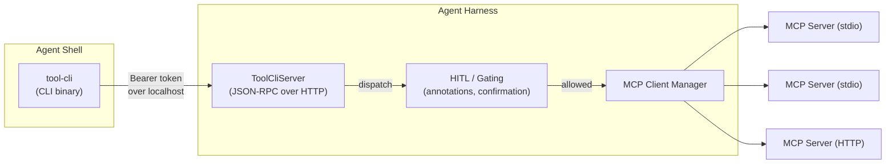

[](https://www.npmjs.com/package/@sammorrowdrums/tool-cli)

# tool-cli

> **Experimental.** Part of the [mcpi-ext](https://github.com/SamMorrowDrums/mcpi-ext) experiment.

For the `1.x` compatibility line, after a `1.x` package is available from npm:

```sh
npm install -g @sammorrowdrums/tool-cli@^1
```

---


> _The Football is not a weapon. The Football is the authority to use weapons. Whoever holds it can reach any server, call any tool, chain any result — but they must do so deliberately, one command at a time._

---

## Why tool-cli exists

MCP gives agents tools. But the way those tools are exposed — all at once, all their schemas dumped into context — creates a problem. The agent sees everything, pays for everything, and still has to guess which tool to call.

**tool-cli is an authenticated MCP-to-shell on-ramp with progressive discovery.**

The agent already has a shell — tool-cli gives that shell a gateway to every
connected MCP server. Discovery happens in steps: servers → tools → schemas →
calls. Each step pays only the tokens it needs. tool-cli emits composable
stdout, while the host's existing `bash` tool owns pipes, files, process
execution, and external programs such as `jq`, `pandoc`, or `ffmpeg`.

This is the nuclear football. It bestows executive control to the holder — every tool on every server is one command away. But like the real nuclear football, there's a dual lock. The agent holds the briefcase, but the harness holds the launch authority. The harness can gate calls, log them, or add human-in-the-loop confirmation at a single choke point. No individual actor goes rogue.

That's the design: **bestow executive control to the agent, but keep the safety in the infrastructure**.

---

## Where tool-cli fits

The surrounding mcpi experiment has four distinct, capability-shaped
facilities. Selection is based on the work to perform, not a fixed precedence:

| Facility                   | Responsibility                                                                                                                                          | Owner                                                       |
| -------------------------- | ------------------------------------------------------------------------------------------------------------------------------------------------------- | ----------------------------------------------------------- |
| Skills                     | Portable domain workflow guidance: sequencing, decisions, and constraints. A server-published skill cannot direct host execution without host approval. | The server publishes; the host activates and enforces trust |
| Code mode                  | Sandboxed deterministic computation and control flow over eligible read-only MCP tools/results, without filesystem, network, or process access.         | `mcpi-ext`                                                  |
| tool-cli                   | Authenticated MCP discovery/calls exposed through the host's `bash` tool as `tool-cli ...`, with machine-composable stdout.                             | This package; `mcpi-ext` hosts the bridge/policy boundary   |
| Bash and external programs | Artifact, document, and data pipelines using pipes, files, `jq`, `pandoc`, `ffmpeg`, and other processes.                                               | mcpi core and the host environment                          |

Use a skill for domain workflow, code mode for exact sandboxed computation,
tool-cli when MCP data must enter a shell pipeline, and bash/external programs
for filesystem or process transformation. A pipeline may combine facilities,
for example `tool-cli ... | jq ...` followed by `pandoc`, but tool-cli itself is
not a pipeline engine and never launches those external programs.

---

## Usage

Discovery is progressive — each step reveals the next:

```sh
tool-cli                                     # List connected MCP servers
tool-cli github                              # List tools on a server
tool-cli github search_code                  # Show schema for a tool
tool-cli github search_code --json           # Full, lossless discovered tool metadata/schema
tool-cli github search_code '{"query":"auth"}' # Call a tool
tool-cli github search_code '{"query":"auth"}' --json # Full, lossless call result
tool-cli --help                              # Local help; no bridge required
tool-cli --version                           # Local CLI version; no bridge required
```

Before any remote command, the CLI performs the authenticated
`getBridgeInfo` handshake and requires bridge protocol major `1`. `--help` and
`--version` are intentionally local-only and work without `TOOL_CLI_PORT`,
`TOOL_CLI_TOKEN`, or a running bridge.

The `1.x` CLI requires a bridge that implements bridge protocol major `1`;
legacy bridges without `getBridgeInfo` are intentionally rejected. Upgrade the
CLI package and embedding harness together when adopting protocol-major
changes. Within major `1`, bridges may add advertised operations and
capabilities, and clients must ignore fields they do not understand.

### Shell composability

This is a CLI. It composes like one.

```sh
tool-cli github search_code '{"query":"auth"}' | jq '.items[].path'

tool-cli myserver list_items '{}' | jq -r '.[0].id' | \
  xargs -I{} tool-cli myserver get_item '{"id":"{}"}'

for city in London Tokyo Paris; do
  echo "=== $city ==="
  tool-cli weather check_weather '{"city":"'"$city"'"}'
done

tool-cli github list_issues '{"repo":"owner/repo"}' --out /tmp/issues.json
```

Errors go to stderr with a nonzero exit code, leaving stdout clean for pipes,
`jq`, and command substitution. `--json` is the lossless form: tool
descriptions retain the complete discovered input/output schemas and metadata,
and calls retain the complete result object (including modern MCP content,
resource links, embedded resources, extension fields, and structured content).

Bridge requests time out after 30 seconds by default. Use
`--timeout <milliseconds>` or `TOOL_CLI_TIMEOUT_MS` (maximum 300000 ms) to
change the bound. Programmatic callers can pass `{ timeoutMs, signal }` to
`rpcCall()` or `getBridgeInfo()`; cancellation is propagated to providers as an
`AbortSignal`.

### Resources

MCP resources and resource templates are reachable through the `resource`
subcommand group, multi-server by default. (`resource` is a reserved word, so a
server literally named `resource` is unsupported — acceptable here.)

```sh
tool-cli resource list                               # List resources across ALL servers, grouped by server
tool-cli resource list --server github               # List one server's resources
tool-cli resource templates                          # List resource templates (all servers)
tool-cli resource templates --server github          # List one server's templates

tool-cli resource read --server github "file:///readme.md"                  # Print text to stdout (pipeable)
tool-cli resource read --server github "file:///readme.md" | grep foo       # Stream + grep
tool-cli resource read --server github "asset://logo" --out logo.png        # Write body to a file
tool-cli resource read --server github "asset://logo" --meta                # Metadata only
tool-cli resource read --server github "file:///readme.md" --json           # Machine-readable
```

Behaviour notes:

- **Multi-server:** `list` / `templates` with no `--server` query every connected server and group the output by server, mirroring how bare `tool-cli` lists servers.
- **Aggregate failures:** complete multi-server failure exits nonzero. Partial success exits zero, prints successful human results to stdout and warnings to stderr, and is explicit in JSON as `{ status: "partial", results: [...] }`. JSON entries include `ok: true|false` and typed error metadata.
- **Server resolution for `read`:** if exactly one server is connected, `--server` is optional; with multiple servers it is required (the error lists the connected server names).
- **`<uri>` is positional** (`resource read --server <name> <uri>`); `--uri <uri>` is still accepted as an alias.
- **Text streams to stdout** by default — pipeable and greppable.
- **Binary content requires `--out` for human output:** a base64 `blob` is never dumped as a raw body. `--json` remains lossless and includes the base64 field; `--out <path>` writes decoded raw bytes.
- **`--out`:** writes the body to the file (text as-is, binary decoded) and prints a one-line metadata summary plus the path instead of the body — parallels `--out` for large tool results.
- **`skill://` URIs are hidden from `resource list` and refused by `resource read`** — skills are a separate channel; `read` rejects a `skill://` URI without contacting the server.
- Resources are read-only; no HITL gating is involved.

Providers that don't implement resources keep working as tools-only — the new
`ToolProvider` methods (`listResources`, `listResourceTemplates`,
`readResource`) are optional, and the server returns a friendly
"does not support resources" error when they're absent.

---

## Security — The Dual Lock and Trusted-Local Boundary

> _They pass the Football to the terminal. It is heavy with potential. Every tool on every server is one command away — but to trigger the tool, the harness must allow it._

The server uses token-based authentication and dynamic port allocation:

1. `start()` binds to a random available port and generates a 32-byte session token
2. Returns `{ port, token }` — the caller sets these as `TOOL_CLI_PORT` and `TOOL_CLI_TOKEN` env vars for agent subprocesses
3. Every request must include `Authorization: Bearer <token>` — rejected with 401 otherwise

This means:

- **Concurrent sessions** work — each gets its own port + token
- **Random processes can't call tools** — they don't have the token
- **Cross-session isolation** — one agent can't reach another's tools
- **No individual actor goes rogue** — the agent has reach, the harness has authority. Both must agree for the launch to proceed

The bridge is a **trusted-local IPC boundary**, not a general remote API. The
short-lived bearer token is a session capability, not encryption: any process
that can read the harness environment can use it for the token's lifetime. Do
not log, persist, commit, or forward the token, and scope its environment to the
intended child process. The transport is plain HTTP and does not provide TLS,
host identity, durable credentials, replay protection, or multi-tenant
authorization. Keep it on loopback or inside an equivalently trusted
container/VM network. If `TOOL_CLI_BIND_HOST` exposes it beyond that boundary,
the embedding harness is responsible for network isolation, token lifetime,
and secret handling.

tool-cli never launches arbitrary external programs. It is an MCP-to-shell
on-ramp: the harness starts the authenticated bridge, and an agent or user
invokes the CLI through an existing shell such as `bash`.

Resource discovery ([#1](https://github.com/SamMorrowDrums/tool-cli/issues/1)) is supported — see [Resources](#resources) above.

---

## Architecture — How the Harness Connection Works

The CLI doesn't connect to MCP servers directly. It speaks authenticated
JSON-RPC to a lightweight HTTP server that runs _inside_ the agent harness.
This is the harness exposing its MCP connections over trusted-local IPC, with
the session bearer token as the second lock.


```mermaid
flowchart LR
    subgraph Agent Shell
        CLI["tool-cli\n(CLI binary)"]
    end

    subgraph Agent Harness
        RPC["ToolCliServer\n(JSON-RPC over HTTP)"]
        MCM["MCP Client Manager"]
        HITL["HITL / Gating\n(annotations, confirmation)"]
        RPC -->|"dispatch"| HITL
        HITL -->|"allowed"| MCM
    end

    CLI -->|"Bearer token\nover localhost"| RPC
    MCM --> S1["MCP Server (stdio)"]
    MCM --> S2["MCP Server (stdio)"]
    MCM --> S3["MCP Server (HTTP)"]
```

Every call — whether from the CLI, from a programmatic client, or from sandboxed code — routes back through the harness. This gives you:

- **Agent activity logging preserved** — because calls flow through the harness, not around it, the existing agent audit trail captures every tool invocation. Nothing bypasses the log
- **Human-in-the-loop at one point** — the harness can check tool annotations (`readOnlyHint`, `destructiveHint`) and gate destructive calls through user confirmation
- **No special setup** — the harness already manages MCP connections. tool-cli just gives the agent shell access to them

```typescript
const { port, token } = await server.start();
// Set env vars so agent-spawned bash/tool-cli can authenticate
pi.setEnv("TOOL_CLI_PORT", String(port));
pi.setEnv("TOOL_CLI_TOKEN", token);
```

The CLI and `rpcCall()` client read both from environment automatically.
Remote CLI commands first call `getBridgeInfo` and reject a different bridge
protocol name or major before discovery/calls.

### Sandboxed / cross-host setups

By default the server binds on `127.0.0.1` and the client connects to `127.0.0.1` — keeping everything on a single loopback. If you're running the agent (which invokes `tool-cli`) inside a container or VM while the harness server runs on the host, the two `127.0.0.1`s refer to different network namespaces and the connection will fail. Two env vars override the host on each side:

| Var                  | Side   | Default     | Use when                                                                |
| -------------------- | ------ | ----------- | ----------------------------------------------------------------------- |
| `TOOL_CLI_BIND_HOST` | server | `127.0.0.1` | the server needs to listen on a non-loopback interface (e.g. `0.0.0.0`) |
| `TOOL_CLI_HOST`      | client | `127.0.0.1` | the client needs to reach the server at a different address             |

```sh
# Host: bind on all interfaces so the container can reach in
TOOL_CLI_BIND_HOST=0.0.0.0 your-harness

# Container: point the CLI/client at the host
TOOL_CLI_HOST=host.docker.internal \
TOOL_CLI_PORT=… \
TOOL_CLI_TOKEN=… \
  tool-cli github search_code '{"query":"auth"}'
```

The bearer-token check still applies on every request — exposing the bind host beyond the loopback only widens reachability, not the auth model. Make sure the surrounding network is appropriately sandboxed.

---

## Package Structure

Three entry points, consumable independently:

```typescript
// Everything (server + client + types)
import { ToolCliServer, rpcCall } from "@sammorrowdrums/tool-cli";

// Server only — for building a harness that serves tool-cli requests
import { ToolCliServer } from "@sammorrowdrums/tool-cli/server";
import type { ToolProvider } from "@sammorrowdrums/tool-cli/server";

// Client only — for calling a running tool-cli server programmatically
import { rpcCall } from "@sammorrowdrums/tool-cli/client";
```

---

## ToolProvider Interface

The server takes a **`ToolProvider`** — a simple interface anyone can implement to bridge tool-cli to their MCP client, agent harness, or tool registry.

```typescript
import { ToolCliServer } from "@sammorrowdrums/tool-cli/server";
import type { ToolProvider } from "@sammorrowdrums/tool-cli/server";

const provider: ToolProvider = {
  getServerNames() {
    return ["my-server"];
  },
  getTools(server) {
    return [
      {
        name: "search",
        description: "Search documents",
        inputSchema: {
          type: "object",
          properties: { query: { type: "string" } },
          required: ["query"],
        },
      },
    ];
  },
  async callTool(server, tool, args) {
    const result = await myMcpClient.callTool(server, tool, args);
    return { content: result.content };
  },
};

const server = new ToolCliServer(provider);
await server.start();
```

The full interface:

```typescript
interface ToolProvider {
  getServerNames(): string[];
  getTools(server: string): ToolInfo[];
  callTool(
    server: string,
    tool: string,
    args: Record<string, unknown>,
    context?: { signal: AbortSignal },
  ): Promise<CallToolResult>;
  getUpstreamMcpSummary?(): {
    protocolVersion?: string;
    implementation?: { name: string; version?: string };
    capabilities?: Record<string, unknown>;
  };
  listResources?(
    server: string,
    context?: { signal: AbortSignal },
  ): Promise<ResourceInfo[]>;
  listResourceTemplates?(
    server: string,
    context?: { signal: AbortSignal },
  ): Promise<ResourceTemplateInfo[]>;
  readResource?(
    server: string,
    uri: string,
    context?: { signal: AbortSignal },
  ): Promise<ReadResourceResult>;
}

interface ToolInfo {
  name: string;
  description?: string;
  inputSchema: Record<string, unknown>;
  outputSchema?: Record<string, unknown>;
  annotations?: Record<string, unknown>;
}

interface CallToolResult {
  content: unknown[];
  isError?: boolean;
  structuredContent?: unknown;
  [key: string]: unknown;
}
```

`listResources`, `listResourceTemplates`, and `readResource` also receive the
optional request context with its cancellation signal. Older providers remain
source-compatible because all context and resource methods are optional.

The bridge validates both the requested server/tool and the arguments against
the exact `inputSchema` returned by `getTools(server)` before
`provider.callTool` runs. Validation supports JSON Schema 2020-12 (default),
2019-09, and draft-07, including the standard format vocabulary. Unknown tools
and invalid arguments return JSON-RPC `-32602` with structured `data`; an
invalid discovered schema returns `-32603`.

---

## Implementing a Server

The `ToolProvider` interface is intentionally minimal — three methods. Here's guidance for different integration scenarios:

### MCP SDK (TypeScript/JavaScript)

If you're using `@modelcontextprotocol/sdk`, the provider wraps your `Client` instances:

```typescript
import { Client } from "@modelcontextprotocol/sdk/client/index.js";

class McpToolProvider implements ToolProvider {
  private clients = new Map<string, { client: Client; tools: ToolInfo[] }>();

  getServerNames() {
    return [...this.clients.keys()];
  }
  getTools(server) {
    return this.clients.get(server)?.tools ?? [];
  }
  async callTool(server, tool, args) {
    const { client } = this.clients.get(server)!;
    const result = await client.callTool({ name: tool, arguments: args });
    return {
      content: result.content as unknown[],
      structuredContent: result.structuredContent as
        Record<string, unknown> | undefined,
    };
  }
}
```

### Other languages — implement the JSON-RPC server directly

You don't need this package to run a tool-cli compatible server. Implement the
versioned JSON-RPC protocol over authenticated HTTP in any language. A
compatible bridge must implement `getBridgeInfo`; the other operations are
advertised by the handshake:

**Go:**

```go
func handleRPC(w http.ResponseWriter, r *http.Request) {
    var req struct {
        Method string          `json:"method"`
        Params json.RawMessage `json:"params"`
        ID     int             `json:"id"`
    }
    json.NewDecoder(r.Body).Decode(&req)

    switch req.method {
    case "getBridgeInfo": // return the bridge protocol v1 contract
    case "listServers":  // return { servers: [...] }
    case "listTools":    // parse server from params, return tools
    case "describeTool": // parse server+tool, return schema
    case "callTool":     // parse server+tool+arguments, call MCP, return result
    }
}
```

**Python (Flask):**

```python
from flask import Flask, request, jsonify

app = Flask(__name__)

@app.route("/", methods=["POST"])
def rpc():
    req = request.json
    method = req["method"]
    params = req.get("params", {})

    if method == "listServers":
        result = {"servers": [{"name": "my-server", "toolCount": 5, "examples": ["search"]}]}
    elif method == "listTools":
        result = {"server": params["server"], "tools": [...]}
    elif method == "describeTool":
        result = {"name": params["tool"], "description": "...", "inputSchema": {...}}
    elif method == "callTool":
        result = call_mcp_tool(params["server"], params["tool"], params.get("arguments", {}))
    else:
        return jsonify({"jsonrpc": "2.0", "error": {"code": -32601, "message": "Not found"}, "id": req["id"]})

    return jsonify({"jsonrpc": "2.0", "result": result, "id": req["id"]})
```

**Rust:**

```rust
// Use axum, actix-web, or any HTTP framework
// Parse JSON-RPC request, match on method, return JSON-RPC response
// The 4 methods map directly to your MCP client's list/describe/call operations
```

### Key implementation notes

- **Bind to `127.0.0.1` only** unless the embedding harness provides an equivalent trusted network boundary
- **`TOOL_CLI_PORT` env var** — the CLI reads this to find the server
- **`TOOL_CLI_TOKEN` env var** — every operation, including `getBridgeInfo`, requires `Authorization: Bearer <token>`
- **Handshake first** — return bridge protocol name `tool-cli-bridge`, major `1`, version `1.0`, server implementation name/version, operation list, and capabilities
- **`structuredContent`** — if the MCP tool returns structured output, include it alongside `content`. The CLI prefers it for JSON piping
- **Error responses** — use JSON-RPC error codes: `-32602` for invalid params, `-32601` for unknown methods, `-32603` for internal errors
- **Tool annotations** — include `readOnlyHint`, `destructiveHint` etc. in `describeTool` responses. The harness can use these for HITL gating

---

## Writing Clients in Other Languages

The JSON-RPC protocol is callable from any language. The CLI reads `TOOL_CLI_PORT` and `TOOL_CLI_TOKEN` from environment:

```python
import os, requests

port = os.environ["TOOL_CLI_PORT"]
token = os.environ["TOOL_CLI_TOKEN"]

def tool_cli(method, **params):
    r = requests.post(f"http://127.0.0.1:{port}", json={
        "jsonrpc": "2.0", "method": method, "params": params, "id": 1
    }, headers={"Authorization": f"Bearer {token}"})
    result = r.json()
    if "error" in result:
        raise Exception(result["error"]["message"])
    return result["result"]

bridge = tool_cli("getBridgeInfo")
assert bridge["bridgeProtocol"]["name"] == "tool-cli-bridge"
assert bridge["bridgeProtocol"]["major"] == 1
servers = tool_cli("listServers")
tools = tool_cli("listTools", server="github")
result = tool_cli("callTool", server="github", tool="get_me", arguments={})
```

---

## JSON-RPC Protocol

The server binds to `127.0.0.1` on a dynamic port. The port and auth token are communicated via `TOOL_CLI_PORT` and `TOOL_CLI_TOKEN` environment variables. Every request is authenticated.

| Method                  | Params                        | Returns                                                                           |
| ----------------------- | ----------------------------- | --------------------------------------------------------------------------------- |
| `getBridgeInfo`         | —                             | Bridge protocol/server identity, operations, capabilities, optional `upstreamMcp` |
| `listServers`           | —                             | `{ servers: [{ name, toolCount, examples }] }`                                    |
| `listTools`             | `{ server }`                  | `{ server, tools: [{ name, description, hasStructuredOutput }] }`                 |
| `describeTool`          | `{ server, tool }`            | Complete discovered tool metadata and schemas                                     |
| `callTool`              | `{ server, tool, arguments }` | Complete provider result; arguments validated before dispatch                     |
| `listResources`         | `{ server }`                  | `{ server, resources }`                                                           |
| `listResourceTemplates` | `{ server }`                  | `{ server, templates }`                                                           |
| `readResource`          | `{ server, uri }`             | Complete `{ contents, ... }` provider result                                      |

### Bridge protocol v1 handshake

```json
{
  "bridgeProtocol": {
    "name": "tool-cli-bridge",
    "major": 1,
    "version": "1.0"
  },
  "serverImplementation": {
    "name": "@sammorrowdrums/tool-cli",
    "version": "1.0.2"
  },
  "operations": [
    "getBridgeInfo",
    "listServers",
    "listTools",
    "describeTool",
    "callTool",
    "listResources",
    "listResourceTemplates",
    "readResource"
  ],
  "capabilities": {
    "authentication": { "required": true, "scheme": "bearer" },
    "tools": {
      "discovery": true,
      "calls": true,
      "inputSchemaValidation": true,
      "jsonSchemaDialect": "https://json-schema.org/draft/2020-12/schema",
      "supportedJsonSchemaDialects": [
        "https://json-schema.org/draft/2020-12/schema",
        "https://json-schema.org/draft/2019-09/schema",
        "http://json-schema.org/draft-07/schema#"
      ]
    },
    "resources": { "list": true, "templates": true, "read": true },
    "cancellation": { "providerAbortSignal": true }
  },
  "upstreamMcp": {
    "protocolVersion": "2025-06-18",
    "implementation": { "name": "embedding-harness", "version": "1.2.3" },
    "capabilities": {}
  }
}
```

`upstreamMcp` is optional and intentionally open for MCP-era implementation,
protocol, and capability summaries supplied by the embedding provider.

Protocol-major changes are breaking. Additive operation/capability fields may
arrive within major `1`; consumers must ignore unknown fields. Current CLIs are
deliberately incompatible with legacy bridges that do not implement
`getBridgeInfo`—upgrade the CLI package and embedding harness together.

### Migrating from 0.x

1. Upgrade the embedding harness so it serves the authenticated
   `getBridgeInfo` protocol v1 contract and preserves complete tool/resource
   results.
2. Deploy the harness and CLI together; a `1.x` CLI does not fall back to an
   older bridge.
3. After the `1.x` package is available from npm, install or update with
   `npm install -g @sammorrowdrums/tool-cli@^1`.

### Embedding-harness counterpart requirements

An embedding harness such as mcpi-ext must:

1. Upgrade its tool-cli server dependency so the authenticated
   `getBridgeInfo` method and bridge protocol v1 metadata are served.
2. Keep `TOOL_CLI_PORT` and the per-session `TOOL_CLI_TOKEN` in the shell
   environment; no handshake endpoint is unauthenticated.
3. Return the exact policy-visible/discovered `ToolInfo.inputSchema` from
   `getTools(server)`. The bridge now rejects unknown servers/tools and invalid
   arguments before `callTool`, so the discovery view and call boundary must
   describe the same allowed tool set.
4. Optionally implement `getUpstreamMcpSummary()` with the current upstream MCP
   protocol version, implementation identity/version, and capabilities.
5. Accept the optional provider request context and forward or observe
   `context.signal` in tool/resource calls where the upstream MCP client
   supports cancellation.
6. Preserve complete MCP tool/resource results rather than narrowing content
   block variants or extension fields before returning them to tool-cli.

### Typed client failures

The client exports `RpcHttpError` (status, body, content type, optional nested
RPC code/data), `RpcProtocolError` (JSON-RPC code/data/id),
`RpcNonJsonResponseError` (status/body/content type),
`RpcInvalidResponseError`, `RpcTransportError`, `RpcTimeoutError`,
`RpcAbortError`, and `BridgeCompatibilityError`. This keeps policy and
transport failures inspectable without writing diagnostics to stdout.

---

## License

MIT
