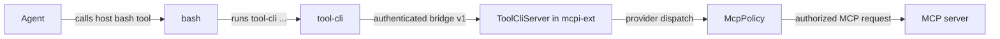

[](https://www.npmjs.com/package/@sammorrowdrums/tool-cli)

# tool-cli

`tool-cli` is an authenticated MCP-to-shell on-ramp with progressive
discovery. It lets an agent harness expose its existing MCP connections to a
command-line program without turning that program into a separate MCP client or
a general-purpose execution engine.

With `mcpi-ext`, the agent invokes `tool-cli` **through mcpi's `bash` tool**:

```text
mcpi agent -> bash tool -> tool-cli -> authenticated local bridge -> MCP policy -> MCP server
```

`tool-cli` is a program, not an LLM-callable tool. Bash and the programs it
launches remain the pipeline substrate: they own pipes, files, loops, `jq`,
`grep`, `pandoc`, `ffmpeg`, and other processes. `tool-cli` only discovers MCP
capabilities, calls them through the bridge, and writes the requested result.

## Supported mcpi integration

This documentation was audited against the following published versions:

| Package                    | Version   |
| -------------------------- | --------- |
| `@sammorrowdrums/mcpi`     | `0.85.0`  |
| `@sammorrowdrums/mcpi-ext` | `1.0.0`   |
| `@sammorrowdrums/tool-cli` | `1.0.3`   |
| tool-cli bridge protocol   | major `1` |

The standalone tool-cli package requires Node.js `>=22.13.0`. The combined
stack requires Node.js `>=22.19.0`, the requirement imposed by mcpi `0.85.0`.

Install the audited versions globally so both `mcpi` and the `tool-cli` binary
are on `PATH`:

```sh
npm install -g \
  @sammorrowdrums/mcpi@0.85.0 \
  @sammorrowdrums/mcpi-ext@1.0.0 \
  @sammorrowdrums/tool-cli@1.0.3
```

Use the
[current mcpi-ext Quick Start](https://github.com/SamMorrowDrums/mcpi-ext#quick-start)
for MCP server configuration and startup. To reproduce the exact integration
audited here, use the
[mcpi-ext 1.0.0 Quick Start](https://github.com/SamMorrowDrums/mcpi-ext/blob/v1.0.0/README.md#quick-start).

`mcpi-ext@1.0.0` depends on `@sammorrowdrums/tool-cli@^1.0.2` for the bridge
library. Installing `tool-cli` explicitly at the top level also makes its CLI
binary available to commands launched by mcpi.

## Quick start with mcpi-ext

After installing the three packages, configure MCP servers as described by the
[mcpi-ext Quick Start](https://github.com/SamMorrowDrums/mcpi-ext#quick-start),
then start mcpi:

```sh
mcpi \
  --extension "$(npm root -g)/@sammorrowdrums/mcpi-ext/dist/index.js" \
  --mcp-config ~/.config/mcpi-ext/mcp.json
```

During session startup, `mcpi-ext@1.0.0`:

1. Starts a `ToolCliServer` inside the extension process.
2. Authenticates to it and verifies the complete bridge-v1 surface.
3. Exposes `TOOL_CLI_HOST`, `TOOL_CLI_PORT`, and `TOOL_CLI_TOKEN` to
   session-spawned commands only after verification succeeds.
4. Routes every tool and resource operation back through its `McpPolicy`
   authorization boundary.
5. Removes usable credentials and stops the bridge when the session shuts
   down.

The agent can then call mcpi's `bash` tool with commands such as:

```sh
tool-cli
tool-cli github
tool-cli github search_code
tool-cli github search_code '{"query":"auth"}'
```

These examples describe commands run by the session's bash tool. Installing the
binary globally does **not** grant access to a running session. An unrelated
terminal normally lacks the session's random port and bearer token, so it
cannot locate or authenticate to the bridge.

In mcpi `0.85.0`, values set with `pi.setEnv()` are applied to subprocesses
spawned for that session, including the LLM-callable bash tool and `pi.exec()`.
They are not written to mcpi's own `process.env`. See mcpi's
[extension-set session variables documentation](https://github.com/SamMorrowDrums/mcpi/blob/v0.85.0/packages/coding-agent/docs/environment-variables.md#extension-set-session-variables).

## CLI usage

### Local metadata

These commands do not connect to a bridge and work without any `TOOL_CLI_*`
variables:

```sh
tool-cli --help
tool-cli --version
```

For `@sammorrowdrums/tool-cli@1.0.3`, `--version` prints:

```text
1.0.3
```

### Progressive discovery and calls

All other commands require an authenticated bridge:

```sh
tool-cli                                      # List connected MCP servers
tool-cli github                               # List tools on one server
tool-cli github search_code                   # Describe one tool
tool-cli github search_code --json            # Full discovered metadata/schema
tool-cli github search_code '{"query":"auth"}' # Call the tool
tool-cli github search_code '{"query":"auth"}' --json
```

Before each remote command, the CLI calls the authenticated `getBridgeInfo`
method and requires bridge protocol name `tool-cli-bridge` with major version
`1`. A legacy bridge without `getBridgeInfo`, or a bridge with a different
protocol major, is rejected. There is no compatibility fallback.

The standalone client validates the protocol name and major. The audited
`mcpi-ext@1.0.0` integration performs a stricter startup check before exposing
credentials: it requires the full operation list, authentication, discovery,
calls, input validation, all resource operations, provider cancellation,
implementation identity, and upstream MCP diagnostics.

The bridge also supports an opt-in Unix-domain-socket transport for embeddings
that place the CLI in a network-isolated container. The audited
`mcpi-ext@1.0.0` integration above uses the backward-compatible TCP mode; an
embedding must explicitly supply a socket path to enable UDS mode.

### Shell composition

Because the host bash tool owns process execution, normal shell composition
works without tool-cli becoming the pipeline engine:

```sh
tool-cli github search_code '{"query":"auth"}' | jq '.items[].path'

tool-cli inventory list_items '{}' |
  jq -r '.[].id' |
  xargs -I{} tool-cli inventory get_item '{"id":"{}"}'

tool-cli github list_issues '{"repo":"owner/repo"}' \
  --out /tmp/issues.json
```

## Output, errors, and timeouts

### Tool output

- Human discovery output is a compact summary intended for reading.
- Human call output prefers `structuredContent` when it is present. Otherwise,
  text content is printed as text and non-text MCP content blocks are serialized
  as JSON.
- `--json` is the lossless form. Tool descriptions retain complete schemas,
  annotations, icons, and extension fields. Tool calls retain the complete
  provider result, including `content`, `structuredContent`, `isError`,
  resource links, embedded resources, image/audio blocks, and extension fields.
- `--out <path>` on a tool call writes the selected UTF-8 output to the file and
  prints a short write summary instead of the result body.

### Error behavior

Ordinary CLI, transport, authentication, compatibility, validation, and tool
errors exit nonzero and write diagnostics to stderr. Stdout stays empty so a
failed call cannot masquerade as valid pipeline data. An MCP tool result with
`isError: true` is also treated as a failed command; with `--json`, the complete
error result is written to stderr.

Multi-server resource discovery has one intentional machine-output exception:
`resource list --json` and `resource templates --json` always emit their
aggregate result to stdout. The result contains `status: "complete"`,
`"partial"`, or `"failed"` and an `ok` flag for each server. Partial success
exits zero; complete failure exits nonzero.

The client library exposes typed failures:

- `RpcHttpError`
- `RpcProtocolError`
- `RpcNonJsonResponseError`
- `RpcInvalidResponseError`
- `RpcTransportError`
- `RpcTimeoutError`
- `RpcAbortError`
- `BridgeCompatibilityError`

`RpcTransportError` also identifies the selected `transport`, safe endpoint
description, and underlying error `code`. When `TOOL_CLI_SOCKET` is set, missing,
refused, and inaccessible socket diagnostics name the socket path without
printing the bearer token.

### Timeouts and cancellation

Every bridge request has a finite 30-second default timeout:

```sh
tool-cli github search_code '{"query":"auth"}' --timeout 60000
TOOL_CLI_TIMEOUT_MS=60000 tool-cli github search_code '{"query":"auth"}'
```

The accepted range is `1` to `300000` milliseconds. Programmatic callers can
pass `{ timeoutMs, signal }` to `rpcCall()` and `getBridgeInfo()`. CLI
termination and client cancellation abort the HTTP request; compatible bridges
receive an `AbortSignal` for asynchronous tool and resource provider methods.

## Resources

The bridge-v1 resource surface is read-only: it lists resources, lists
templates, and reads resource content.

```sh
tool-cli resource list
tool-cli resource list --server docs
tool-cli resource templates
tool-cli resource templates --server docs

tool-cli resource read --server docs file:///readme.md
tool-cli resource read --server docs file:///readme.md --json
tool-cli resource read --server docs file:///readme.md --meta
tool-cli resource read --server media asset://logo --out logo.png
```

Behavior:

- Without `--server`, `list` and `templates` query every connected server and
  group results by server.
- `read` can omit `--server` only when exactly one server is connected.
- The URI is positional. `--uri <uri>` remains an accepted alias.
- Text content streams to stdout by default.
- Human output never writes a base64 blob or decoded binary bytes to stdout.
  Binary content requires `--out <path>`.
- `--out` writes text as UTF-8 and base64-decodes binary resource content to raw
  bytes.
- `--json` preserves the complete resource result, including base64 `blob`
  fields.
- `--meta` prints content metadata without printing or writing the body.
- Partial multi-server success keeps successful results and identifies each
  failed server. Human output sends warnings to stderr; JSON output records
  typed per-server errors.
- `resource` is a reserved top-level subcommand, so a server literally named
  `resource` cannot be addressed by the CLI grammar.

The CLI hides `skill://` entries from `resource list` and refuses to read a
`skill://` URI. That is an isolation rule, not skill support. Skills and
`load_skill` are features of `mcpi-ext`, not of tool-cli. The audited
`mcpi-ext@1.0.0` policy also blocks resources declared as skill-owned through
its skills protocol, including skill resources that use another URI scheme.

Providers may omit resource methods when embedding `ToolCliServer` elsewhere.
The bridge advertises the resulting capability flags and returns a clear
not-supported error for unavailable operations. `mcpi-ext@1.0.0` requires all
three resource methods before it advertises tool-cli as available.

## Security boundary

`ToolCliServer.start()` generates a random 32-byte session token. By default it
preserves the existing behavior and binds HTTP to a random TCP loopback port.
Calling `startUnixSocket(socketPath)` instead serves the same authenticated
HTTP/JSON-RPC protocol over an explicitly selected Unix-domain socket and
creates no TCP listener. Every request, including `getBridgeInfo`, must carry
the token as an HTTP bearer credential.

Bearer authentication answers only "does this process possess the session
capability?" It is not tool authorization. A process that obtains the token can
attempt every operation advertised by that bridge. The embedding provider or
harness must decide which servers, tools, arguments, and resources are allowed.

The server itself restricts calls to discovered servers and tools and validates
arguments against each tool's complete discovered `inputSchema` before provider
dispatch. The audited `mcpi-ext@1.0.0` provider adds the policy boundary: it
exposes only policy-visible schemas, reauthorizes every call, enforces skill
gating and resource isolation, requests confirmation for non-read-only tools,
and audits allowed and denied operations.

The bridge is trusted-local IPC, not a remote service:

- HTTP is unencrypted and supplies no TLS identity, durable credentials, replay
  protection, or multi-tenant authorization.
- Any process that can read the session's environment can use the bearer token
  for its lifetime. Do not log, persist, commit, copy, or forward it.
- Unix socket mode requires possession of **both** the mounted session socket
  and its bearer token. The socket is session-scoped and is not sufficient by
  itself.
- Keep the server on loopback unless an equivalent container or VM network
  boundary is in place.
- `mcpi-ext@1.0.0` pins bridge verification to loopback, masks inherited
  `TOOL_CLI_*` credentials until verification succeeds, and strips all
  `TOOL_CLI_*` variables from stdio MCP child environments.

### Unix socket mode for container egress sandboxes

Use a dedicated absolute path whose immediate parent belongs only to the
session:

```typescript
import { mkdtemp } from "node:fs/promises";
import { tmpdir } from "node:os";
import { join } from "node:path";
import { ToolCliServer } from "@sammorrowdrums/tool-cli/server";

const sessionDirectory = await mkdtemp(join(tmpdir(), "tool-cli-session-"));
const socketPath = join(sessionDirectory, "bridge.sock");
const server = new ToolCliServer(provider);
const { token } = await server.startUnixSocket(socketPath);
```

The server creates a missing parent with mode `0700`; an existing parent must
already be owned by the current user with mode `0700`. It refuses relative or
non-normalized paths, unsafe foreign-owned or writable ancestors, a symlink at
the final socket entry, non-socket entries, foreign sockets, and active sockets.
Existing ancestor aliases are resolved to their canonical path before any
directory is created, so system aliases such as macOS `/var` cannot redirect a
later cleanup. Use the returned canonical `socketPath` for clients and mounts.
Only an owned, verified stale socket is removed. The published socket is mode
`0600`, is removed by `stop()` and normal termination signals, and is never
blindly unlinked during close.

The ownership and write-permission checks apply to **every ancestor**, not only
the immediate `0700` parent. For example, `/tmp/tool-cli/session` is still
refused when `/tmp/tool-cli` is mode `0775`, even if `session` is mode `0700`.
Creating the dedicated session directory directly with `mkdtemp()` under the
OS sticky temp directory is the reliable pattern used in the example above.

While the server is running, the dedicated directory also contains a private
mode-`0600` hard link named `.tc-*`. It reserves Node's internal close-time
pathname so another session cannot occupy it; clients and container mounts must
use the explicitly returned public `socketPath`, never the private link.

Signal cleanup preserves host signal semantics. If the embedding process
already handles a signal such as `SIGHUP` (including a one-shot handler),
tool-cli leaves the live socket in place and the host remains responsible for
calling `stop()` during its own shutdown path. The process-exit hook remains a
final cleanup guard.

Mount the dedicated directory into the container, use the path as seen inside
the container, and preserve ownership mapping so the `0700` directory and
`0600` socket remain usable. On a rootful Docker daemon without user namespace
remapping, run the container with the same numeric UID:

```sh
docker run --rm --network none \
  --cap-drop ALL \
  --security-opt no-new-privileges \
  --user "$(id -u):$(id -g)" \
  --mount type=bind,src="$sessionDirectory",dst=/run/tool-cli,readonly \
  --env TOOL_CLI_SOCKET=/run/tool-cli/bridge.sock \
  --env TOOL_CLI_TOKEN \
  your-agent-image
```

With rootless Docker, container UID `0` maps to the invoking host user, so use
`--user 0:0` (or omit `--user`) instead of copying the host UID numerically.
Daemons configured with `userns-remap` need an explicit mapping that grants the
container process access to the host-owned session directory; fail closed if
that mapping is not known.

On a rootful daemon, do **not** run the sandbox as container root. Root's
`DAC_OVERRIDE` capability bypasses the `0700` directory and `0600` socket modes,
so those modes provide no cross-session isolation to a root process that can
see multiple session paths. Use the mapped non-root session UID, mount only its
dedicated socket directory, drop all capabilities, and enable
`no-new-privileges` as shown above. Rootless container UID `0` is different: it
maps to the invoking unprivileged host user rather than host root.

The launcher supplies `TOOL_CLI_TOKEN` through the child environment; the
token value must never appear in command arguments, logs, or process titles.
Before injecting the current session values, strip inherited bridge variables
so stale TCP or UDS credentials cannot leak into the sandbox:

```typescript
const childEnv = Object.fromEntries(
  Object.entries(process.env).filter(([name]) => !name.startsWith("TOOL_CLI_")),
);
childEnv.TOOL_CLI_SOCKET = "/run/tool-cli/bridge.sock";
childEnv.TOOL_CLI_TOKEN = token;
```

`TOOL_CLI_SOCKET` takes precedence over `TOOL_CLI_HOST` and `TOOL_CLI_PORT`.
In UDS mode, omit those TCP variables entirely. The socket pathname may differ
between host and container because the client uses the mounted pathname from
its own filesystem namespace.

Maintainers with a local `node:22` container image can run the unprivileged,
network-disabled mount smoke test with `npm run test:uds:docker`. The script
matches exact Docker security-option names, detects rootless Docker, rejects
unsupported `userns-remap`, and fails closed on unrecognized output. It uses
`--pull never` and does not publish anything. Override the preloaded image through
`TOOL_CLI_DOCKER_IMAGE` when needed.

Advanced cross-network-namespace deployments can override the two hosts:

| Variable             | Used by | Default     |
| -------------------- | ------- | ----------- |
| `TOOL_CLI_BIND_HOST` | server  | `127.0.0.1` |
| `TOOL_CLI_HOST`      | client  | `127.0.0.1` |

Binding outside loopback widens who can attempt authentication. The embedding
harness is then responsible for network isolation, secret handling, and token
lifetime.

## Architecture

The CLI does not connect directly to MCP servers. It speaks authenticated
JSON-RPC 2.0 over HTTP, carried by TCP loopback or a Unix socket, to a bridge
embedded in the agent harness.


```mermaid
flowchart LR
    Agent["Agent"] -->|"calls host bash tool"| Bash["bash"]
    Bash -->|"runs tool-cli ..."| CLI["tool-cli"]
    CLI -->|"authenticated bridge v1"| Bridge["ToolCliServer in mcpi-ext"]
    Bridge -->|"provider dispatch"| Policy["McpPolicy"]
    Policy -->|"authorized MCP request"| MCP["MCP server"]
```

The separation is deliberate:

- The harness owns MCP connections, policy, confirmation, and audit.
- The bridge library exposes a narrow authenticated RPC surface.
- The CLI turns that surface into stdout, stderr, files requested with
  `--out`, and process exit codes.
- Bash remains responsible for all external programs and persistent shell
  effects.

## Library API

The package has three supported entry points:

```typescript
import { ToolCliServer, rpcCall } from "@sammorrowdrums/tool-cli";
import { ToolCliServer } from "@sammorrowdrums/tool-cli/server";
import { rpcCall } from "@sammorrowdrums/tool-cli/client";
```

### Embedding a bridge

Implement `ToolProvider` around an existing MCP client or policy layer:

```typescript
import { ToolCliServer } from "@sammorrowdrums/tool-cli/server";
import type { ToolProvider } from "@sammorrowdrums/tool-cli/server";

const provider: ToolProvider = {
  getServerNames() {
    return ["docs"];
  },
  getTools(server) {
    return toolRegistry.getTools(server);
  },
  async callTool(server, tool, args, context) {
    return mcpPolicy.callTool(server, tool, args, context?.signal);
  },
  async listResources(server, context) {
    return mcpPolicy.listResources(server, context?.signal);
  },
  async listResourceTemplates(server, context) {
    return mcpPolicy.listResourceTemplates(server, context?.signal);
  },
  async readResource(server, uri, context) {
    return mcpPolicy.readResource(server, uri, context?.signal);
  },
};

const server = new ToolCliServer(provider);
const { port, token } = await server.start();
```

The caller must place `port` and `token` in the intended child process
environment as `TOOL_CLI_PORT` and `TOOL_CLI_TOKEN`. Do not copy them into the
parent process environment unless the parent itself is the intended client.

For a Unix socket, opt in explicitly:

```typescript
const { socketPath, token } = await server.startUnixSocket(
  "/run/user/1000/tool-cli/session-123/bridge.sock",
);
```

Place the client-visible path in `TOOL_CLI_SOCKET` and the token in
`TOOL_CLI_TOKEN`; do not inject `TOOL_CLI_HOST` or `TOOL_CLI_PORT`. The returned
`StartResult` reports `transport: "tcp" | "unix"`, keeps `port` for backward
compatibility (`0` in UDS mode), and includes `socketPath` in UDS mode.

`ToolProvider` has three required methods:

```typescript
interface ToolProvider {
  getServerNames(): string[];
  getTools(server: string): ToolInfo[];
  callTool(
    server: string,
    tool: string,
    args: Record<string, unknown>,
    context?: { signal: AbortSignal },
  ): Promise<CallToolResult>;

  getUpstreamMcpSummary?(): UpstreamMcpSummary | undefined;
  listResources?(
    server: string,
    context?: { signal: AbortSignal },
  ): Promise<ResourceInfo[]>;
  listResourceTemplates?(
    server: string,
    context?: { signal: AbortSignal },
  ): Promise<ResourceTemplateInfo[]>;
  readResource?(
    server: string,
    uri: string,
    context?: { signal: AbortSignal },
  ): Promise<ReadResourceResult>;
}
```

Tool metadata and results are open to extension fields so modern MCP content is
preserved rather than narrowed. Input validation supports JSON Schema 2020-12,
2019-09, and draft-07, including standard formats.

### Bridge protocol v1

The current operation surface is:

| Method                  | Params                        | Result                                             |
| ----------------------- | ----------------------------- | -------------------------------------------------- |
| `getBridgeInfo`         | `{}`                          | Protocol, implementation, operations, capabilities |
| `listServers`           | `{}`                          | Connected server summaries                         |
| `listTools`             | `{ server }`                  | Tool summaries for one server                      |
| `describeTool`          | `{ server, tool }`            | Complete discovered tool metadata                  |
| `callTool`              | `{ server, tool, arguments }` | Complete provider tool result                      |
| `listResources`         | `{ server }`                  | Complete resource list                             |
| `listResourceTemplates` | `{ server }`                  | Complete resource template list                    |
| `readResource`          | `{ server, uri }`             | Complete resource contents                         |

Every request is JSON-RPC 2.0 over authenticated HTTP. A bridge-v1.1 TCP
handshake identifies itself as:

```json
{
  "bridgeProtocol": {
    "name": "tool-cli-bridge",
    "major": 1,
    "version": "1.1"
  },
  "serverImplementation": {
    "name": "@sammorrowdrums/tool-cli",
    "version": "1.0.3"
  },
  "capabilities": {
    "transport": {
      "type": "tcp",
      "networkListener": true
    }
  }
}
```

UDS mode reports `"type": "unix"` and `"networkListener": false`. The transport
metadata is additive within bridge major `1`; existing clients that validate
only the protocol name and major continue to interoperate.

Protocol-major changes are breaking. A `1.x` client rejects a bridge with a
different major and does not fall back to a pre-handshake protocol. Additive
fields may appear within major `1`; consumers must ignore fields they do not
understand.

## License

MIT
